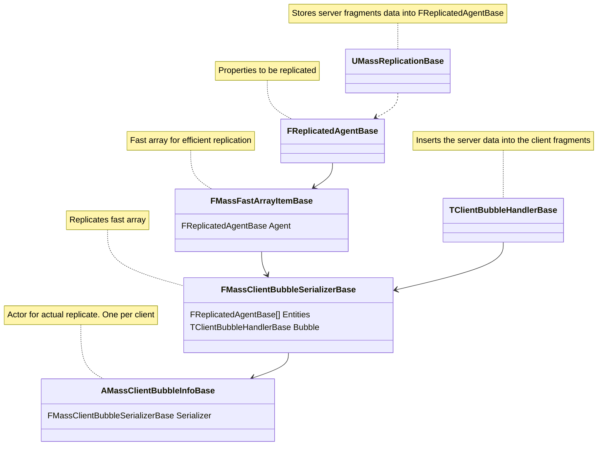

```mermaid  
classDiagram
	direction TB
    class UMassReplicationBase {
    }
    note for UMassReplicationBase "Stores server fragments data into FReplicatedAgentBase"
    
	class FReplicatedAgentBase {
	}
	note for FReplicatedAgentBase "Properties to be replicated"

	class FMassFastArrayItemBase {
		FReplicatedAgentBase Agent
	}
	note for FMassFastArrayItemBase "Fast array for efficient replication"
	
	class FMassClientBubbleSerializerBase {
		FReplicatedAgentBase[] Entities
		TClientBubbleHandlerBase Bubble
	}
	note for FMassClientBubbleSerializerBase "Replicates fast array"

	class TClientBubbleHandlerBase {
	}
	note for TClientBubbleHandlerBase "Inserts the server data into the client fragments"

	class AMassClientBubbleInfoBase {
		FMassClientBubbleSerializerBase Serializer
	}
	note for AMassClientBubbleInfoBase "Actor for actual replicate. One per client"

	UMassReplicationBase ..> FReplicatedAgentBase
	FReplicatedAgentBase --> FMassFastArrayItemBase
	FMassFastArrayItemBase --> FMassClientBubbleSerializerBase
	TClientBubbleHandlerBase --> FMassClientBubbleSerializerBase
	FMassClientBubbleSerializerBase --> AMassClientBubbleInfoBase
```